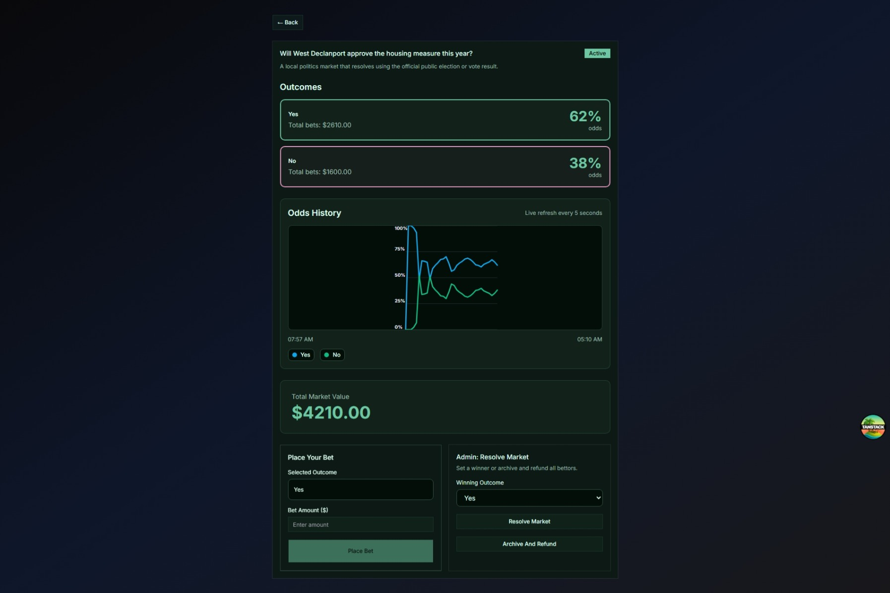

# Prediction Market App

This is a full-stack prediction market app built on Bun, SQLite, React 19, and TanStack Router.

## Preview

### Screenshot



### Demo Video

[Watch demo video](assets/demo.mkv)

## What It Does

Users can register, log in, browse markets, place bets, resolve markets as admins, and track balances and payouts. The app also supports bot access through API keys generated from the profile page.

## Implemented Tasks

### 1. Main Dashboard
- Shows all active markets with title, outcomes, current odds, and total bet amount.
- Supports sorting by creation date, total bet size, or number of participants.
- Supports filtering by market status.
- Shows 20 markets per page with next/previous navigation.
- Refreshes odds and totals automatically every few seconds.

### 2. User Profile Page
- Shows active bets with live current odds.
- Shows resolved bets with market title, selected outcome, and win/loss state.
- Paginates active and resolved lists separately, 20 items per page.
- Includes an API key section for bot usage.

### 3. Market Detail Page
- Shows a chart of bet distribution by outcome.
- Shows current odds for each outcome.
- Lets users select an outcome and place a bet.
- Validates that bet amounts are positive.
- Refreshes active market data automatically.

### 4. Leaderboard
- Ranks users by total winnings in descending order.
- Shows each user’s name and total winnings.
- Is paginated.

### 5. Role System
- Supports `user` and `admin` roles.
- The first account becomes admin automatically if no admin exists.
- Admin controls are only shown to admins.

### 6. Admin Market Resolution
- Admins can resolve a market by selecting the winning outcome.
- Admins can archive a market.
- Admin access is required.

### 7. Payout Distribution
- Winners are the bets that match the resolved outcome.
- The total pool is distributed proportionally by stake.
- Payouts are stored and user balances are updated.

### 8. User Balance Tracking
- Users start with a balance of 1000.
- Bet amounts are deducted when placed.
- Winnings are added when markets resolve.
- Refunds are added when markets are archived.

## Bonus Task: API Keys For Bots

This is implemented.

Users can generate an API key from the Profile page and use it to access the same authenticated endpoints as the frontend.

Supported with `x-api-key`:
- Create markets
- List markets
- Place bets
- View outcomes and market details
- Access current user data and bet lists

API key lifecycle:
- Generate a key from Profile
- Show the key once
- Revoke or regenerate later
- Store only hashed keys on the server

## Tech Stack

### Backend
- Bun
- Elysia
- SQLite
- Drizzle ORM
- JWT auth plus API-key auth

### Frontend
- React 19
- TanStack Router
- Tailwind CSS
- shadcn/ui-style components

### Runtime
- Docker Compose

## Running the App

### With Docker Compose

```bash
docker compose up --build
```

Services:
- Frontend: `http://localhost:3005`
- Backend: `http://localhost:4005`

### Local Development

Backend:

```bash
cd server
bun install
bun run dev
```

Frontend:

```bash
cd client
bun install
bun run dev
```

## Main API Endpoints

Auth:
- `POST /api/auth/register`
- `POST /api/auth/login`

Markets:
- `GET /api/markets`
- `GET /api/markets/:id`
- `GET /api/markets/:id/odds-history`
- `POST /api/markets`
- `POST /api/markets/:id/bets`
- `POST /api/markets/:id/resolve`
- `POST /api/markets/:id/archive`

Users:
- `GET /api/users/me`
- `GET /api/users/me/bets`
- `GET /api/users/leaderboard`

API key management:
- `GET /api/users/me/api-key`
- `POST /api/users/me/api-key`
- `DELETE /api/users/me/api-key`

## Validation

Backend coverage includes:
- Auth flows
- Market creation and listing
- Betting and validation
- Role restrictions
- Market resolution and archival
- Payout and refund distribution
- Balance updates
- API key generation and revocation
- API-key-authenticated requests

Primary test file:
- `server/test/api.test.ts`

## Notes

- Real-time updates are implemented with short-interval polling.
- API keys are intended for bot access and should be treated like passwords.
- If you see the old `import.meta.env` editor warning, the app still runs correctly in the container and browser.

## Submission

See `submission/README.md` for submission-specific notes.
